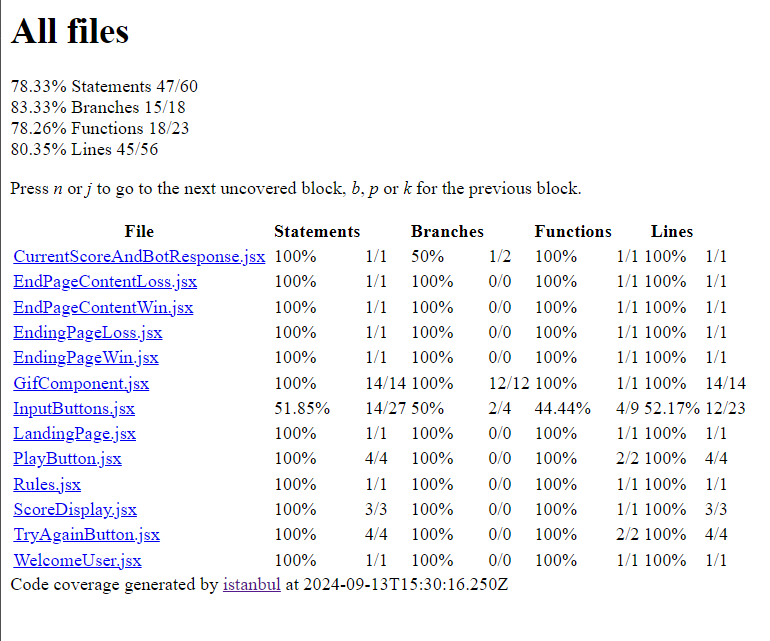

# How to Play:
1. Enter the run you want to score using button.
2. If the number match the number generated by Computer your player is OUT.
3. If it does not match then the runs will be added to your score.

# Deployed Link
[mohdfahadiitk.github.io/CS455_GAME/](https://mohdfahadiitk.github.io/CS455_GAME/)

# Cricket Game

This project is a Book Style Cricket game built with Reactjs as part of the CS455 coursework.

Test coverage



Kindly check Metrices folder for code quality, coverage and tests comparison before and after this homework.

## Node Packages Used

- **ESLint**: Enforces code quality through linting with custom rules.
- **Jest**: A framework for unit testing.
- **Jest**: Provides test coverage reporting.
- **SonarQube**: Ensures overall code quality and highlights potential issues.

## Running Code Quality Tools

### Linting
To lint the code and enforce coding standards:
```bash
npm run lint
```
### Testing and Test Coverage
To run the unit tests:
```bash
npm test --coverage
```
### Code quality
To analyze the code with SonarQube:
```bash
npm run sonar
```
# Work Done

## Debugging
- Identified and fixed multiple issues during **BUG BASH** and testing.
- Corrected code to resolve the errors found.

## Refactoring
- Refactored the JavaScript code.
- Introduced **ESLint** to improve code maintainability.
- Integrated **SonarQube**, addressing code smells, duplication, and security vulnerabilities.

## Testing
- Developed comprehensive **unit tests** for the entire application.
- Created a functional test for easier manual verification.

## DevOps
- Configured CI pipelines using `.yml` files to enforce quality gates:
  1. **ESLint** for code linting.
  2. **Jest** for unit testing.
  3. **Jest** for code coverage.
  4. **SonarQube** for static code analysis.
- Automated deployment to **GitHub Pages** after passing all tests.
